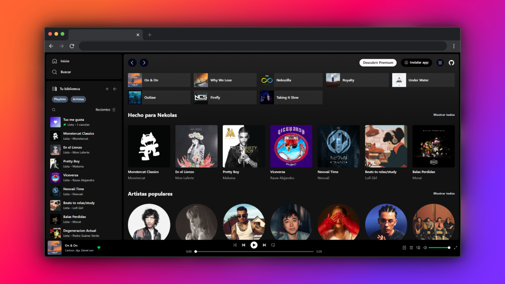
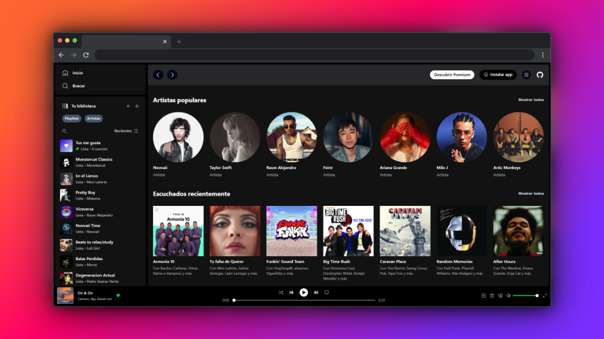
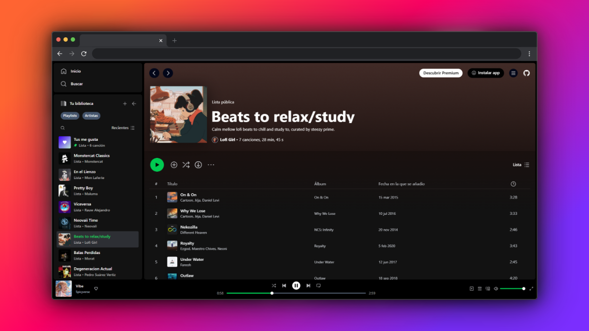
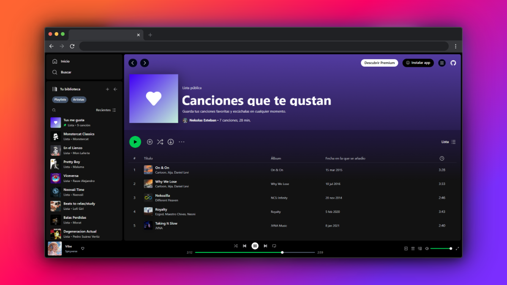

<p align="center">
  <a href="" rel="noopener">
 </a>
</p>
<h3 align="center">Spotify Clone</h3>

---

<p align="center">
    Clon de la aplicación Spotify, desarrollado con fines académicos, permitiendo la reproducción de música, creación de listas de reproducción y búsqueda de canciones, emulando la experiencia de la <a href="https://www.spotify.com">plataforma original</a> 
    <br>
    <br> 
</p>


## 📝 Table of Contents

- [📝 Table of Contents](#-table-of-contents)
- [🧐 Problem Statement ](#-problem-statement-)
- [💡 Solution ](#-solution-)
- [🚀 How Does It Work? ](#-how-does-it-work-)
- [🏁 Getting Started ](#-getting-started-)
  - [1️⃣ Clonar el repositorio](#1️⃣-clonar-el-repositorio)
  - [2️⃣ Instalar dependencias](#2️⃣-instalar-dependencias)
  - [3️⃣ Iniciar el servidor de desarrollo](#3️⃣-iniciar-el-servidor-de-desarrollo)
- [🎨 Screenshots \& Previews ](#-screenshots--previews-)
  - [🏠 Página de inicio](#-página-de-inicio)
  - [🎤 Artistas populares](#-artistas-populares)
  - [📑 Página de Playlist](#-página-de-playlist)
  - [❤️ Página de Canciones Favoritas](#️-página-de-canciones-favoritas)
- [📐 Project Structure ](#-project-structure-)
- [⛏️ Technology Stack ](#️-technology-stack-)
- [✍️ Authors ](#️-authors-)

## 🧐 Problem Statement <a name = "problem_statement"></a>

El objetivo de este proyecto fue desarrollar un clon de la aplicación Spotify, replicando sus funcionalidades básicas, como la búsqueda y reproducción de música, la creación y gestión de listas de reproducción, y el acceso a contenido musical.

El desafío consistió en emular la experiencia de usuario de Spotify, manejando una navegación fluida con animaciones entre páginas, y asegurando un diseño responsive para garantizar su adaptabilidad a diferentes dispositivos. Se buscó crear una plataforma intuitiva, que ofrezca una experiencia de streaming de música eficiente y atractiva.

## 💡 Solution <a name = "solution"></a>

Para optimizar la experiencia del usuario, se recreó el clon de Spotify usando tecnologías modernas. La aplicación permite la búsqueda y reproducción de música, la creación de listas de reproducción y el guardado de playlists favoritas utilizando local storage.

Además, se implementó la <strong>Web Audio API</strong> del navegador para la reproducción de audio y se diseñó una interfaz responsive para adaptarse a diferentes dispositivos. La navegación fluida y las animaciones entre páginas mejoran la interacción y hacen la experiencia más agradable.


## 🚀 How Does It Work? <a name="future_scope"></a>

- Los usuarios pueden buscar y reproducir música de manera sencilla.
- La plataforma permite crear y gestionar listas de reproducción, que se guardan en **local storage** para mantenerlas disponibles en futuras sesiones.
- La **Web Audio API** del navegador se utiliza para la reproducción de sonido, con control total sobre el volumen y la calidad de la reproducción.
- Los usuarios pueden guardar sus playlists favoritas, permitiendo un acceso rápido a su música preferida en cualquier momento.
- La interfaz es **responsive**, adaptándose a diferentes dispositivos y pantallas.
- La navegación entre las diferentes secciones es fluida, mejorada con animaciones que hacen la experiencia más interactiva y atractiva.


## 🏁 Getting Started <a name = "getting_started"></a>

### 1️⃣ Clonar el repositorio  
Abre una terminal y ejecuta: 

```bash
git clone https://github.com/Nekolas777/spotify-clone.git
cd spotify-clonbe
```

### 2️⃣ Instalar dependencias
Instala las dependencias del proyecto ejecutando:

```bash
npm install
```

### 3️⃣ Iniciar el servidor de desarrollo
Inicia el servidor de desarrollo ejecutando:

```bash
npm run dev
```

Ahora puedes abrir tu navegador y navegar a `http://localhost:4321` para ver la aplicación en funcionamiento.

## 🎨 Screenshots & Previews <a name="screenshots"></a>

### 🏠 Página de inicio
<i class="fas fa-user-circle"></i>


### 🎤 Artistas populares
<i class="fas fa-microphone-alt"></i>


### 📑 Página de Playlist
<i class="fas fa-list-ul"></i>


### ❤️ Página de Canciones Favoritas
<i class="fas fa-heart"></i>



## 📐 Project Structure <a name="project_structure"></a>

```
.
└── src
    ├── assets
    │   # Contiene recursos estáticos como imágenes, fuentes y estilos globales.
    ├── components
    │   # Componentes reutilizables de la interfaz de usuario (UI) como botones, tarjetas, formularios, etc.
    ├── data
    │   # Archivos y datos estáticos, como archivos JSON, Markdown, o constantes que contienen datos de la aplicación.
    ├── icons
    │   # Contiene los íconos utilizados en la aplicación (pueden ser SVGs, fuentes de íconos, etc.).
    ├── layouts
    │   # Componentes de diseño que estructuran la página como header, footer, sidebar, etc.
    ├── pages
    │   # Páginas que corresponden a diferentes rutas de la aplicación.
    │   └── index.astro
    │   └── about.astro
    │   └── blog.astro
    │   └── [slug].astro   # Páginas dinámicas con rutas parametrizadas.
    ├── router
    │   # Si usas rutas personalizadas, configuraciones de la navegación.
    ├── store
    │   # Gestión de estado global de la aplicación si usas algo como @astro/store o cualquier biblioteca de estado.
    ├── styles
    │   # Archivos CSS, SCSS o cualquier archivo de estilo global de la aplicación.
    ├── utils
    │   # Funciones y helpers reutilizables en toda la aplicación.
    └── astro.config.mjs
        # Configuración global de Astro.

```

## ⛏️ Technology Stack <a name="tech_stack"></a>

- [Astro](https://astro.build/) – Framework moderno para construir sitios rápidos y ligeros, con soporte para múltiples frameworks de componentes.
- [React](https://react.dev/) – Biblioteca de JavaScript para construir interfaces interactivas y reutilizables.
- [Tailwind CSS](https://tailwindcss.com/) – Framework de CSS con clases utilitarias para diseñar interfaces rápidas y responsivas.
- [Zustand](https://zustand-demo.pmnd.rs/) – Biblioteca ligera para la gestión de estado global en aplicaciones React.
- [Swup](https://swup.js.org/) – Biblioteca para transiciones fluidas entre páginas sin recargar el navegador (page transitions).

## ✍️ Authors <a name = "authors"></a>

- [@Nekolas777](https://github.com/Nekolas777)